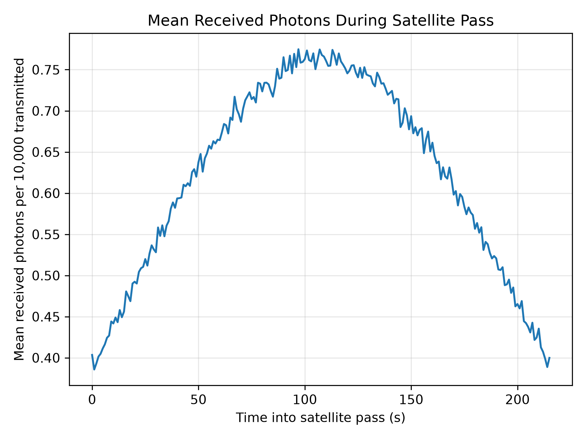
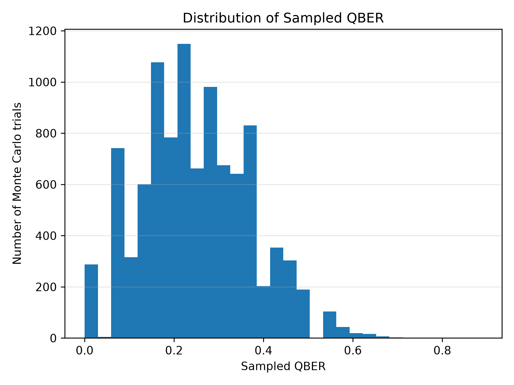
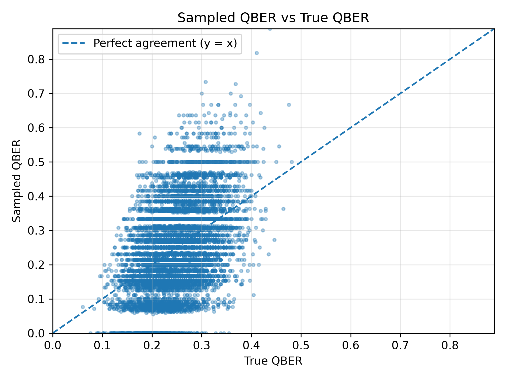

# BB84 Satellite-QKD Simulation

This project simulates an idealized BB84 quantum key distribution link between a ground station and a satellite during one orbital pass. It combines a simple orbital calculation, an optical transmission model, photon-loss sampling, and an intercept-resend attack by Eve.

The project is intended for education and numerical experimentation. It is not a complete model of a real satellite quantum communication system.

## Method

`Orbit.py` uses Skyfield to find the next complete pass of the ISS above 10 degrees elevation for an observer near McMaster University. The pass is evaluated at one-second intervals. At each interval, the satellite elevation and range are passed to `Channel.py`, which calculates a photon survival probability.

## Channel model and parameters

The channel model estimates the probability that a transmitted photon reaches the receiver. It combines:

- a geometric capture term based on aperture sizes, range, wavelength, and beam spreading;
- atmospheric loss, scaled by elevation;
- a fixed pointing efficiency; and
- a fixed optics loss.

The values in `Channel.py` are simplified engineering assumptions chosen to make the simulation numerically plausible. They are not measured parameters for a particular satellite, telescope, or optical terminal.

The wavelength of 785 nm is representative of a near-infrared optical link. The 0.50 m transmitter aperture and 0.30 m receiver aperture are assumed terminal dimensions. The Fried parameter of 0.075 m is an illustrative atmospheric-turbulence value. The 1 dB vertical atmospheric loss, 0.80 pointing efficiency, and 3 dB optics loss are also assumed fixed values rather than results from weather or hardware measurements.

This model does not include a complete link budget, detector efficiency, background counts, weather, cloud cover, realistic pointing dynamics, or a detailed atmospheric turbulence model.

## BB84 model

For every transmitted photon, Alice chooses a random bit and one of the X or Z bases. Bob independently chooses a measurement basis. Eve uses the intercept-resend strategy: she measures each surviving photon in a randomly selected basis and resends the result in that basis.

The main implementation in `BB84_sim.py` uses NumPy arrays. If the relevant bases are compatible, the bit is preserved; otherwise the measurement result is represented by a random bit. This vectorized implementation is used for the main simulation because it is much faster than simulating one quantum circuit at a time.

A Qiskit Aer implementation is retained as a slower reference implementation.

After measurement, Alice and Bob publicly compare their bases and retain only matching positions. Twenty percent of the sifted bits are sampled to estimate the QBER and are then removed from the retained key.

## Interpreting QBER

With equally likely X and Z bases, a complete intercept-resend attack has a theoretical QBER of approximately 25% on the sifted key. Eve chooses an incompatible basis half of the time, and those measurements produce an error half of the time.

The simulation reports two related quantities:

- **True QBER:** the error fraction calculated from every sifted bit in a trial.
- **Sampled QBER:** the estimate calculated from the 20% sample.

The true QBER varies around 25% because each trial is finite. The sampled QBER varies more because it is based on only part of the sifted key.

## Monte Carlo simulation

The default configuration uses 10,000 transmitted photons at each point in the pass and 10,000 independent trials. `Main.py` collects the results and produces three plots.

### Mean received photons



This plot shows the average number of photons received at each second of the pass. The variation is determined mainly by satellite range and elevation through the channel model.

### Sampled QBER distribution



This histogram shows the variation in the 20% QBER estimate across Monte Carlo trials.

### Sampled and true QBER



Each point represents one trial. The horizontal coordinate is the true QBER and the vertical coordinate is the sampled estimate. The dashed line indicates exact agreement.

The figures are saved as 300-DPI PNG files in `images/` and are also displayed when the program runs.

## Project files

- `Orbit.py`: satellite pass calculation using Skyfield.
- `Channel.py`: optical survival-probability model and assumed parameters.
- `BB84_sim.py`: vectorized BB84 implementation and Qiskit Aer reference.
- `Main.py`: Monte Carlo driver, summary statistics, and plotting.
- `tests/test_simulation.py`: tests for the main model behavior.
- `gp.php`: local TLE snapshot used if CelesTrak cannot be reached.

## Installation and use

Create an environment and install the dependencies:

```bash
python -m venv .venv
source .venv/bin/activate
python -m pip install -r requirements.txt
```

Run the simulation with:

```bash
python Main.py
```

The program normally requests a current ISS TLE from CelesTrak. If that request fails, it uses the checked-in `gp.php` snapshot. Since TLE data changes with time, orbital results are not necessarily reproducible from one run to another.

The tests can be run with:

```bash
python -m unittest discover -s tests -v
```

## Limitations

The optical model is intentionally approximate. The simulation does not implement error correction, privacy amplification, finite-key security bounds, or a complete security proof. Its results should be interpreted as a study of the interaction between orbital geometry, photon loss, BB84 basis selection, and intercept-resend errors, rather than as performance predictions for an operational satellite-QKD link.

Possible extensions include a detailed link budget, detector and background-noise models, finite-key analysis, reproducible fixed-TLE runs, and comparison of the NumPy and Aer implementations over matched trials.
